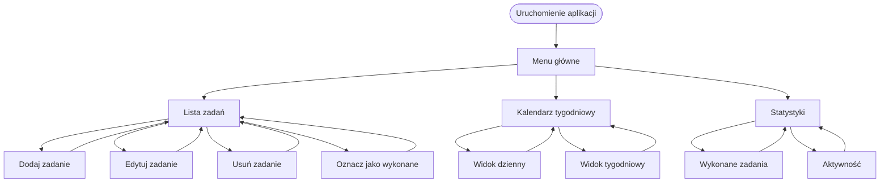

# Diagram projektu

```mermaid
flowchart TD
    Start([Uruchomienie aplikacji]) --> Menu[Menu główne]
    Menu --> Zadania[Lista zadań]
    Menu --> Kalendarz[Kalendarz tygodniowy]
    Menu --> Statystyki[Statystyki]

    Zadania --> DodajZadanie[Dodaj zadanie]
    Zadania --> EdytujZadanie[Edytuj zadanie]
    Zadania --> UsunZadanie[Usuń zadanie]
    Zadania --> OznaczWykonane[Oznacz jako wykonane]

    DodajZadanie --> Zadania
    EdytujZadanie --> Zadania
    UsunZadanie --> Zadania
    OznaczWykonane --> Zadania

    Kalendarz --> WidokDzienny[Widok dzienny]
    Kalendarz --> WidokTygodniowy[Widok tygodniowy]

    WidokDzienny --> Kalendarz
    WidokTygodniowy --> Kalendarz

    Statystyki --> WykonaneZadania[Wykonane zadania]
    Statystyki --> Aktywnosc[Aktywność]

    WykonaneZadania --> Statystyki
    Aktywnosc --> Statystyki
```
